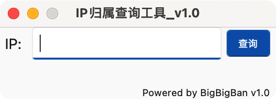
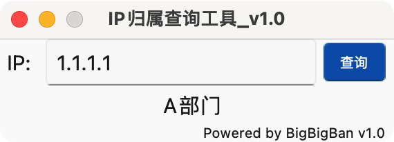

# 为了快速查询企业内的IP归属，基于Tkinter+ttk主题开发的GUI工具

# 使用方法：

首先需要在database.json中录入企业IP归属，可根据现有台账录入，格式如下：

```json
{
    "name": "XX公司(总公司)",
    "networks": [
        "1.1.0.0/16",
        "2.2.0.0/16",
        "3.3.0.0/16"
    ],
    "children": [
        {
            "name": "A部门(下属部门)",
            "networks": [
                "1.1.1.0/24",
                "2.2.2.0/22"
            ]
        },
        {
            "name": "B公司(分公司)",
            "networks": [
                "1.1.4.0/23",
                "2.2.222.0/24",
                "2.2.111.0/22"
            ]
        },
        {
            "name": "C中心(下属二级单位)",
            "networks": [
                "3.3.0.0/16"
            ]
        }
    ]
}
```

配置完成后运行`python3 MainPage.py`即可，输入IP进行查询



查询结果：



# 打包

可以借助pyinstaller打包成exe使用，但需要保证可执行文件同目录下有`sun-valley.tcl`文件和`theme`目录以及`database.json`文件，否则无法运行

ps：有师傅知道怎么把主题文件打包进去的也可以提交issue，谢谢🙏

# TODO
✅ 已完成：

+ 状态栏的添加、copyright的添加
+ 彩蛋添加
+ 支持单个IP添加

❌ 待完成
- IP查重
- 查找算法优化
- 导入文件查询